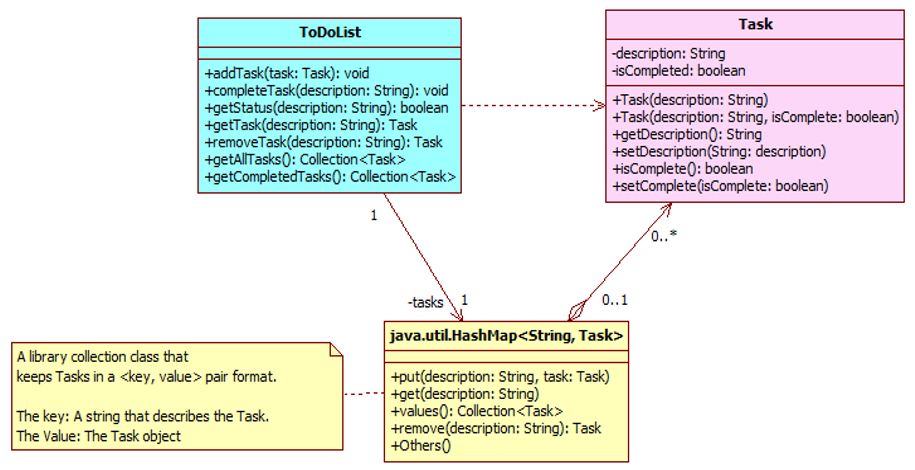

***<u>Introduction</u>***
1.	You are strongly encouraged to try pair programming for this workshop. Choose a partner and take turns writing test cases and writing code. If we have an odd number of people in the class, you can form a 3-person-group programming. A suggested design is provided below.
 

Class Task: This class keeps all the information regarding a task, including task description and status (whether it is completed).
Class ToDoList: This class keeps all the tasks in a HashMap (a Java library class). A HashMap is a Collection class that keeps objects using a key-value pair, where the key uniquely identifies the object (value). The key is used for ease of retrieval of objects. In this case, the key is the task description (which is assumed to be unique for this workshop) and the value is the associated task object.

2.	In this workshop, you are required to complete the ToDoList class. This class can later be used as part of a web application or backend for mobile app.

***Test Case Design***

3.	We have provided the code for the following methods, for you to get started:
getAllTasks(). This method returns a Collection<Task>.

4.	Edit the ‘ToDoListTest.java’ to defining some test cases for the addTask (Task task) method first. Then add code in the addTask() method to pass the test case. For example:
-	When a user adds a to-do item, then an item with the same name is listed when retrieving the list.
-	Given that there is at least one to-do item when retrieving the list, when a user deletes an item, then that item should not appear when retrieving the to-do list.
You can then do the same for the method removeTask().  You should define at least 2-3 test cases for each method of the class. 

***Using Gen-AI***

1.	Using the GitHub Co-pilot plugin that you have installed in your IDE, open the chat window, type in the Prompt to generate JUnit codes for all the methods described in ToDoList.java

2.	Based on the generated JUnit test codes, open the chat window, type in the Prompt to generate the methods’ implementation.

3.	Compare the code generated by Gen-AI and the ones you have done manually.
